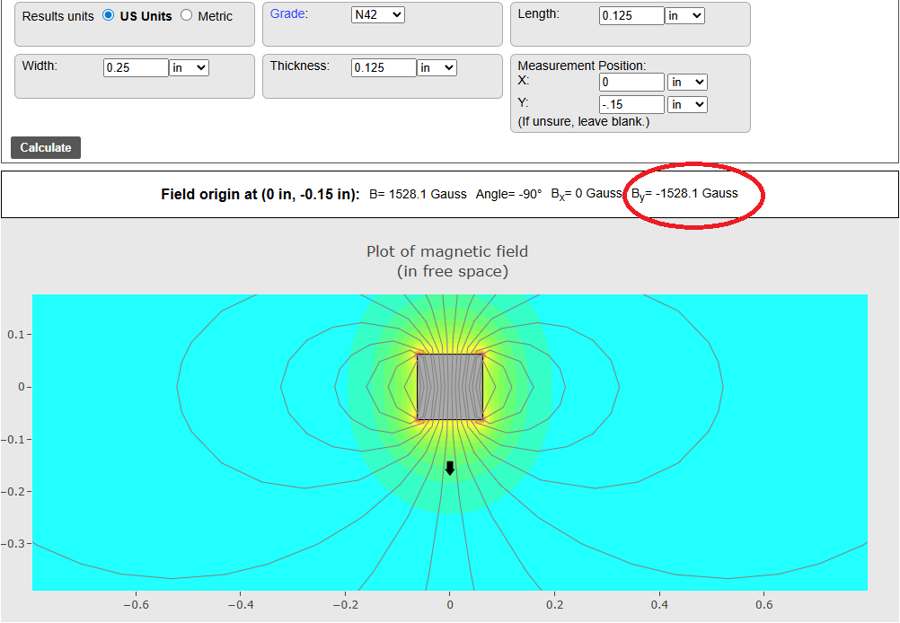
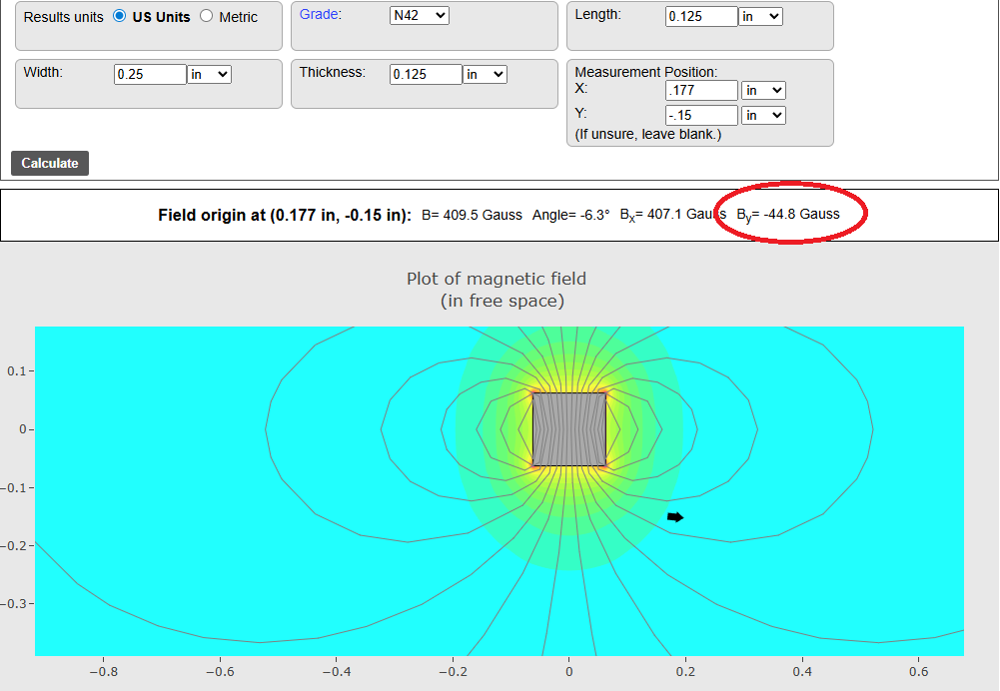
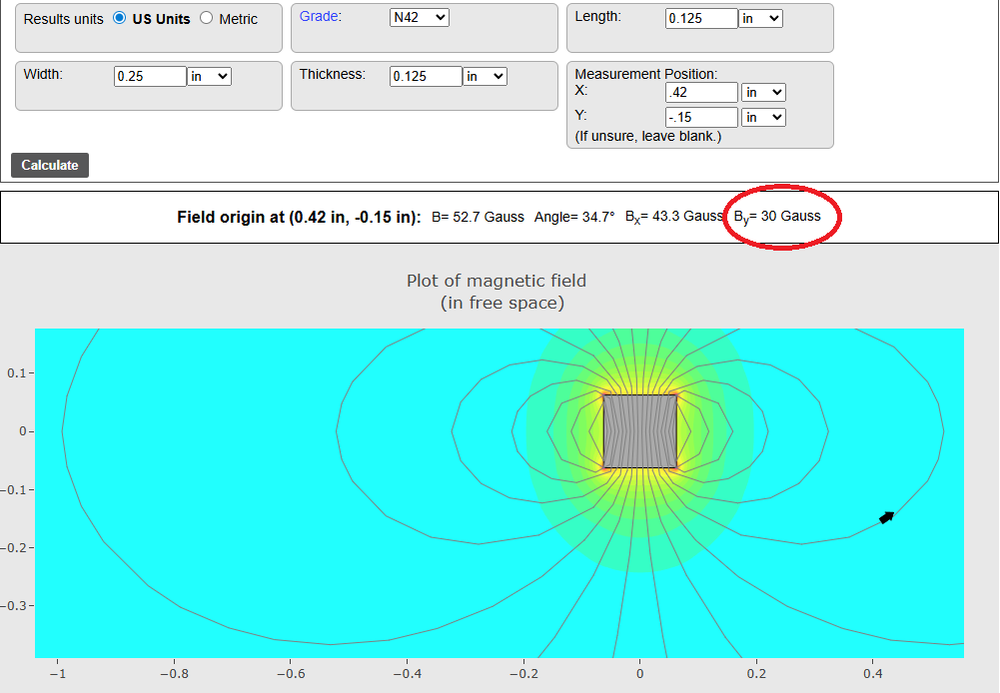
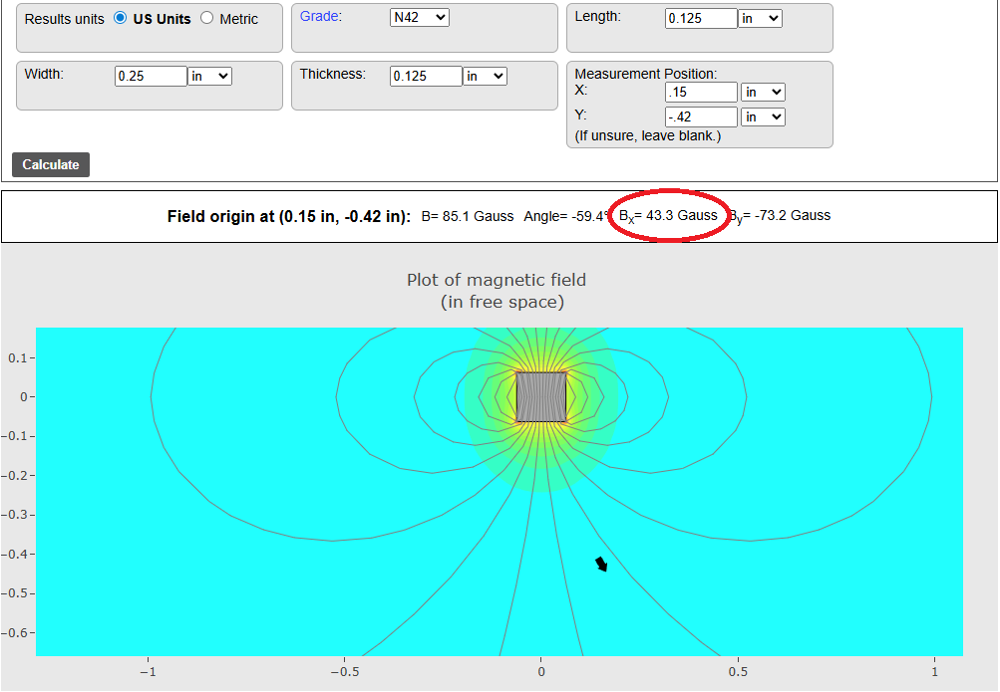

<h1>Magnet Orientation</h1>
The B422 magnet has two faces perpendicular to its pole axis and I'll call the other two
"sideways." Another
magnet with known poles can figure out which face is right: the face that sticks to 
the other magnet IS one of the poles. Here
are some more hints: <a href='https://www.kjmagnetics.com/products.asp?cat=163'>
https://www.kjmagnetics.com/products.asp?cat=163</a>.  For the AH1383, the South pole
must face the PCB.
  
You can also use the assembled
PCB and sketch to read out the magnetic field with the magnet close. When oriented properly,
it will read the maximum negative magnitude about +16000. 
Use the sketch's <code>ReadModeForSeconds</code> command to
make the magnetic field print out continuously. Hold the magnet directly over the Si7210 and then
slide it only 1/8" or so in the 2 directions perpendicular to the magnet.
If you have a pole directly facing the sensor (the 
desired orientation) the sign will not change on the magnetic field. If you have a unipolar
sensor (AH1381) with the correct (South) pole, facing it, stays at +1 at (nearly) equal distances in
all directions from centered over the sensor. With the wrong pole, it reads out 0 and nothing happens at all
as you move the magnet away from the center of the sensor.
If you have an edge toward
the sensor ("sideways"), the sign will change right where the magnet is centered over the sensor. 
The AH1383
version of the sketch also supports the <code>ReadModeForSeconds</code> command, but it
only reads out +1 (for the magnet "close") and 0 for the magnet "far." You need the magnet
oriented so its reads +1 on the AH1383 when centered over the sensor.

<h2>AH1383 thresholds: 45 Gause on, 35 Gause off</h2>
The Si7210 version of this build is especially useful for experimentation because the sketch can
be set for a wide range of on and off thresholds and can be made to operate either omnipolar
or unipolar. However, that part might not be available. The AH1383 has built in thresholds,
on at 45 Gause, and off at 35 Gause, which must
be compatible with the actual magnetic fields of the chosen physical magnet and geometery.
This section describes that calculation.   
The 3D printed rocker and sensor are spaced with the magnet and sensor about .15 inches apart
along the N/S axis of the magnet, which is the Y dimension in the graph below. The rocker moves
the magnet between two positions at X = 0 (magnet and sensor aligned) to about X = .42 inches
where the rocker rests against the opposite stop. The magnetic field calculations are from  
<a href='https://www.kjmagnetics.com/magnetic-field-calculator.asp'>https://www.kjmagnetics.com/magnetic-field-calculator.asp</a>.
Here is what the magnet/sensor geometry looks like for a properly installed magnet and with the
rocker directly under the magnet:

The next graph below shows that this particular magnet need move only a few thousanths of an inch around the
point X=.177 inches for the BY field shift signs, which is where the
amplitude moves through both the ON and OFF thresholds of the part. X=.177 is not quite half
way through the rocker movement with top dead center at X=.42/2 = 0.21 inches. With the magnet installed properly
the sensor position is indicated by the arrow in the screen shots, and the magnet on
the rocker moves left and right across the field as graphed here.

The AH1383 is unipolar, which is important because with the rocker at the far stop, as 
shown below, 
the amplitude of the magnetic field has magnitude above the 35 or 45 Gause threshold,
but of the opposite sign. (Parts specified as "omnipolar" will trigger above a
threshold amplitude of either sign. They won't work here.)

As can be seen from the graphs above, the parts AH1382 and AH1381 are suitable substitutes
for the AH1383 specified for this build. The -82 and -81 parts have smaller thresholds,
but, because all the parts in this series are unipolar, and because the field is of opposite
polarity on opposite ends of the rocker travel, all the parts should work and
will switch states very close to the X=.177 point where the field polarity reverses. 
A backwards magnet will get the same field amplitudes, but in opposite polarity, which
means only the AH1381 has any hope of turning on, and then only when the magnet is
as far as possible from the sensor. Backwards won't work.
<h4>Sideways magnet calculation</h4>
The field calculator can also be used to predict what will happen if the magnet is incorrectly
installed
"sideways." Spoiler alert: it won't work. Sideways means the magnet is with its N/S pole axis along 
the face of the rocker as opposed to facing
the sensor. To calculate that behavior, reverse the X and Y everywhere they appear in the calculator. 
The sensor position in this graph is at the arrow as in the graphs above, but moves up and down as the rocker moves.
The calculator predicts zero amplitude BX at X=0 (not graphed--the answer is zero),
peaking at about X=0.1 inch 
with about 700 Gause (also not graphed), and dropping down to about 40 Gause at the far rocker rest stop of X=0.42.

Slight movement of the rocker around X=0 will move the field both above the ON threshold and below the
OFF threshold. Therefore, multiple redundant signalling the rocker around X=0 can be expected. This
applies to both possible incorrect sideways orientations. (Only the polarity of the field at the
sensor is reversed with respect to the other sideways orientation.)
<h2>Sketch parameter setup</h2>
All the magnetic field calculations in the previous section apply to the Si7210, but
the Si7210 and its sketch have many programmable settings for 
thresholds and polarity. That is, the Si7210 can support
a much wider range of magnet strengths and geometry. In the physical designs presented here, it means
smaller magnets can be used than specified, and the N/S axis orientation can work in two
directions, rather than just the one that the AH1383 must see.
Th sketch parameter advice here applies to both physical arrangements, the Oregon Scientific funnel retrofit, and 
3D printable design presented here. 
<ul><li>Mount the magnet with either its N
or S pole facing the sensor as described in the previous section.</li>
<li>The recommended Si7210 interrupt threshold and hysteresis settings are a relatively
low magnitude (1500 out of a maximum of 16000) and small hysteresis (8 out of 1792). The commands
are:
<pre>
<code>SetSWOP 0x64
SetSWHYST 0
</code></pre></li>
<li>The Si7210 interrupts per the previous item, but the chip's interrupt output does not
directly correspond to the magnet position. The sketch, therefore, is coded to originate
a notification of a rocker move based on the magnetic field going outside the range
specified as below. 
<pre>
If the North pole faces the sensor:
<code>SetNearThreshold 1500
SetFarThreshold 0
SetSignedThreshold 0
</code>If the South pole faces the sensor:<code>
SetNearThreshold -1500 <i>Note it is negative</i>
SetFarThreshold 0
SetSignedThreshold 1
</code>
</pre>
The NearThreshold and FarThreshold are signed, and need to be different based on the
magnet orientation. The OP and HYST values in the Si7210 are not signed, and do not
depend on the magnet orientation.
</li>
</ul>
The sketch, per the above settings, is waked up by any motion of the magnet around the value 1500,
and then polls the magnetic field looking for it to go outside the range NearThreshold and FarThreshold.