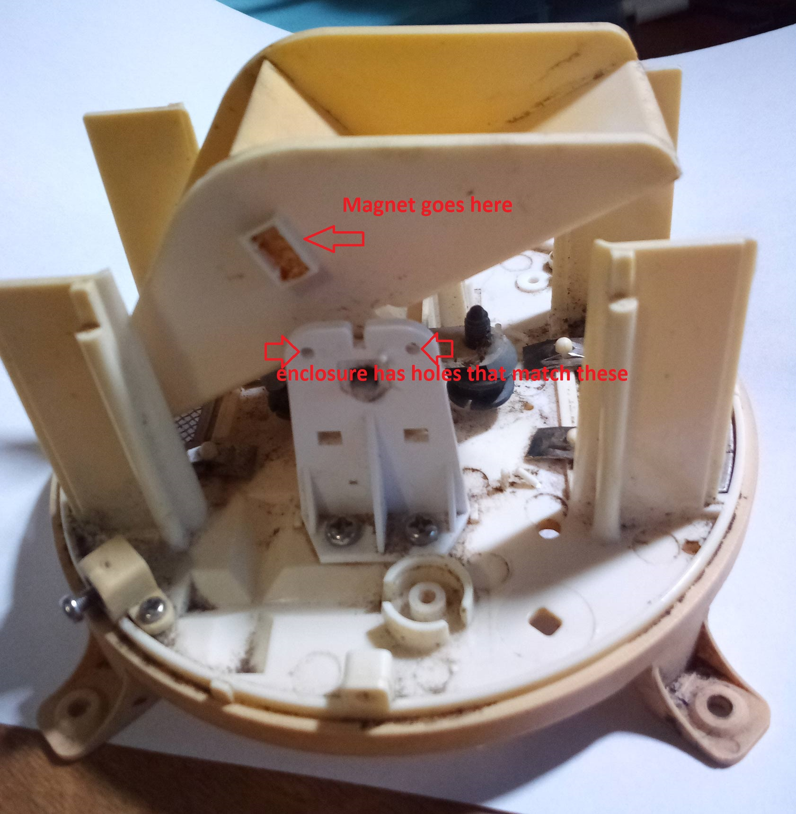
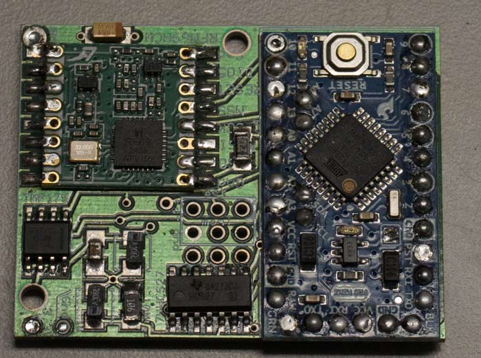
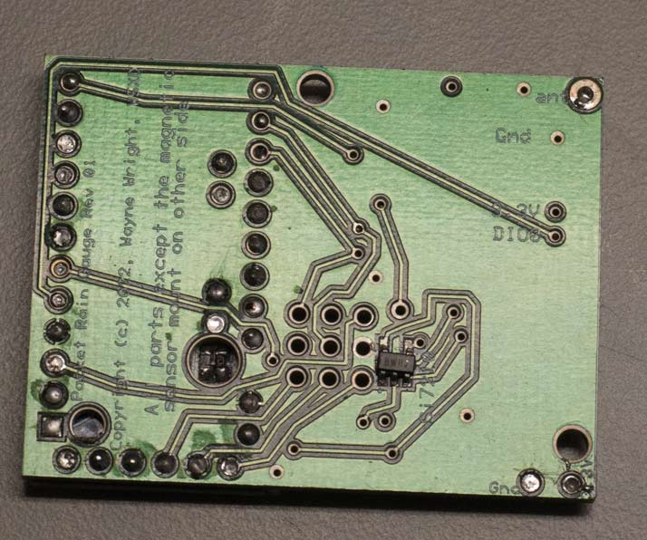
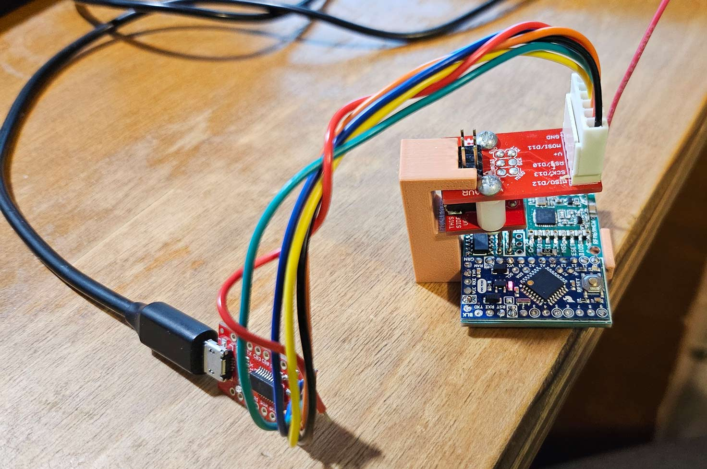

# Packet Rain Gauge

This design is for a device that telemeters a packet when a magnet approaches, and
again when it retreats from a hall effect sensor model Si7210. It consists
of a Printed Circuit Board (PCB) design, an Arduino sketch, and two variations on a funnel
that catches rain. One variant is a retrofit to install in a discarded rain gauge funnel
from an Oregon Scientific RGR126N Wireless Rain Gauge. If you don't 
have an RGR126N to retrofit, there is included  a 3D printable outdoor untit, which I designed
as a remix of this 
<a href='https://www.thingiverse.com/thing:4725413'>thingiverse rain gauge</a>.

This unit can telemeter to 
<a href='https://github.com/w5xd/PacketGateway'>an open-source packet gateway</a>.  Separately, or 
concurrently, this <a href='https://github.com/w5xd/WWVBclock'>WWVB clock</a> can monitor the packet
transmissions from this rain gauge. Or you derive your own design from the sources here. 

<h3>3D Print the Outdoor Assembly</h3>
The CAD directory in this repo has 3D 
models for the parts needed to all the outdoor parts.
STL files are downloadable from the <a href='https://www.thingiverse.com/thing:7052595'>thingiverse 7052595 posting of this remix</a>. 
All the STLs can be regenerated (or modified to your liking) using a combination of
OpenSCAD and FreeCAD. Each is open sourced and free.
The list of parts to print, starting with those designed with OpenSCAD is:
<ul>
<li><code>Pluviometer-base</code> (which requires the support enforcer <code>Pluviometer-base-supports</code>)</li>
<li><code>funnel-improved</code></li>
<li><code>Pluviometer-AA-print</code></li>
<li><code>bucket-improved</code></li>
<li>The flange I designed, <code>Pluviometer-flange-print</code>, fits snugly on the top of the T-profile steel fence post
I wanted to mount it. Unless you have the same fenceposts as me, you will have to use some other mount.
</li>
</ul>
The parts designed with FreeCAD are:
<ul>
<li><code>Placement-sensor enclosureBody001</code></li>
<li><code>Placement-sensor enclosureBody002</code></li>
</ul>

The PCB enclosure parts need to geometrically mate with both the Pluviometer-base, designed in OpenSCAD,
and the printed circuit board outline and hole pattern, which is available as a STEP model. The motivation for using FreeCAD
is that it can be configured to create a model that itself depends on both the OpenSCAD model of the base and bucket,
and the STEP model of the PCB. While the
FreeCAD method for a dependency on a STEP model is simply its File/Import method, FreeCAD has a not-quite-obvious
workflow for modeling dependencies on an STL mesh. Follow FreeCAD's File/Import of the OpenSCAD STL with
its Parts Workbench "Create Points From Geometry" method. The resulting points object can then be used
to create DatumPoint and DatumPlane references that can, in turn, be referenced in Sketches. The caveat is that this workflow
does not automatically accommodate subsequent changes to the OpenSCAD design. That is, any subsquent change in the OpenSCAD
design requires the FreeCAD model to be completely recreated manually.

<h3>Oregon Scientific Retrofit</h3>
The original Oregon Scientific rain gauge mechanical design is a funnel that directs rainfall into a rocker
that is centered below the funnel. The rocker (called a "bucket" in the thingiverse design) has two identical cups arranged on a see-saw. After 1mm
of rainfail, the higher cup has enough weight to rock the see-saw. The higher
one falls to become the lower one and dumps its water from the now lowered cup. The new position leaves 
the opposite
cup&mdash;which was empty&mdash;under the funnel. It begins to fill with new rainfall and the process repeats. In the middle of the
rocker&mdash;centered, which means it does not affect the center of mass between the two cups&mdash;is a magnet. 
The PCB detects the magnet swinging
by. 

The RGR126N design sensed the passing of the magnet using a reed relay. Such a relay has ferro magnetic 
contacts that close as
the magnet is in proximity. The original relay sensor was positioned for closest approach 
to the relay
as the rocker passed top dead center
in both directions, which means the rocker was moving relatively quickly as the relay sensed it.  

The
Si7210 hall effect magnetic sensor is used in this design instead of a reed relay. The Si7210
senses at 5 times per second which is a little slow to
reliably detect fast passage of the magnet through top dead center. However, the Si7210 can
easily be programmed to separately detect the arrival and the departure of the magnet from
proximity to the sensor. This design does that. It positions its sensor
in close alignment with the rocker at its resting position with one
cup down&mdash;the left one in the photo above. Its Arduino
sketch is programmed to separately report the arrival and departure of the rocker, sending a packet for
each. The new magnet is mounted in the same recess in the rocker as the old magnet. 
The needed magnet is slightly heavier than the original: about 0.5g as
opposed to 0.3g on my scale, so a calibration check is in order before putting it into service.
The result is this design sends packets at (almost) the same rate per volume of rainfall
as the old one, just not quite at the exact same rocker positions.

The sensor manufacturer publishes a detailed discussion about magnets&mdash;including details
about this exact scenario: replacing a reed relay with an Si7210&mdash;about how the
magnet axis and sensor geometry are related: 
<a href='https://www.silabs.com/documents/public/application-notes/an1018-si72xx-sensors.pdf'>
https://www.silabs.com/documents/public/application-notes/an1018-si72xx-sensors.pdf<a>.
A K&J Magnetics B422 magnet conveniently matches the original magnet's dimensions to
fit in the original rocker, and has its
poles aligned so that its
pole axis as required to penetrate the Si7210 when mounted in the original rocker.

The original water tight
battery compartment is retained, but after removing the PCB that shares the
battery enclosure. This upgrade runs on two AA cells just like the original. I had
no luck running the Oregon Scientific device using lithium AA cells, but this design works
well with them and gets the much longer battery life with the lithium cells'
 much larger Ampere-hour capacity compared to alkaline.

This retrofit parts list is:
<ul>
<li> The original funnel's plastic parts minus the two PCBs, and with the
original magnet removed from the rocker. It was glued in place and a small screwdriver can pry it out.
<li> The PCB as documented in this repository. It mounts the Arduino, 
a TMP175 sensor, and an RFM69 packet radio module. Gerber files are <a href='./PCB'>here</a>.
<li> A <a href='https://www.kjmagnetics.com/proddetail.asp?prod=B422'>K&J Magnetics B422 neodymium magnet</a>. 
dimensions are 1/8" x 1/8" x 1/4" which fit into the same mounting hole on the original rocker.
Note there is a required orientation of the new magnet that takes some care when
you glue it. See <a href='#MAGNET_ORIENTATION'>below</a>.
<li> A 3D printable enclosure that mounts on the same hole pattern
as the one of the original PCBs&mdash;the one facing the magnet on the rocker.
<li> Two AA cells inside the original plastic battery compartment. The
battery's original ribbon cable is replaced with just a pair. +3VDC and GND wires are routed 
to the replacement PCB. This design can use either
alkaline or lithium cells. 
</ul>

<h3>The Arduino sketch</h3>
The sketch sends a packet to the Packet Gateway every time the 
magnet on the rocker arm either arrives at, or departs from the
sensor. The message
packet also contains a battery voltage measurement, the TMP175
reading, and other details. The sketch also sends a packet after
a timed interval absent any rainfail, which enables battery level
monitoring at the gateway. The timed interval is settable, and
once per 24 hours is enough. The temperature reading at the funnel is 
useful mainly for
monitoring the condition of the funnel assembly. Direct
sunlight on the funnel makes its value not representative
of ambient air temperature because the funnel must be 
mounted in the open to be useful as a rain gauge.

The gateway's processing of the rainfall messages is not part of this
repository. See the repository at https://github.com/w5xd/diysha for
an example. In that project, the receipt of rainfall packets writes a
text file that, in turn, can be read by the "bins" feature in <a href='http://www.gnuplot.info'>gnuplot</a>.

<h2> Construction</h2>

The <a href='https://www.sparkfun.com/products/11114'>Arduino Pro Mini</a> requires the 
following PCB options to be made in order to work 
in this project:
<ul>
<li>The 3.3V version of the Pro Mini is <b>required</b> as opposed to the 5V version.
<li>Jumper SJ1 (top side, close to the GND pad) must be desoldered to remove the red power LED's power drain.
<li>The bottom side i2c pullup positions, R1 and R3, can each have a 4.7K 
resistor installed. Two SMD 0603 size resistors just fit inside a hole
in the PCB designed to clear them. Alternatively, REV02 of the PCB has positions for SMD
0804  pull up resistors that are not quite so tiny.
<li>The 330 ohm resistor just inside pins D11 and D12 can be removed (or cut with a diagonal 
cutter.) This
disables the green LED to prevent its battery drain and load on the SCK line. The LED is
almost never turned on by the sketch, so removing it saves very little.
</ul>

PCB Parts
<ul>
<li>Sparkfun Arduino <a href='https://www.sparkfun.com/arduino-pro-mini-328-3-3v-8mhz.html'>Pro Mini</a> in 3.3V
<li>Sparkfun <a href='https://www.sparkfun.com/rfm69hcw-wireless-transceiver-915mhz.html'>
RFM69HCW</a></li>
<li><a href='https://www.silabs.com/documents/public/data-sheets/si7210-datasheet.pdf'>Si7210-B-04-IVR</a> I2C Hall effect sensor in SOT-23-5 package</li>
<li><a href='https://www.ti.com/lit/ds/symlink/sn74hcs27.pdf'>SN74HCS27DR</a> Triple 3-Input NOR Gates with Schmitt-Trigger Inputs in 14 SOIC package</li>
<li>TMP175 temperature sensor in 8 SOIC package
<li>10M resistor size SMD 1206
<li>2.7K resistor size SMD 1206
<li>2 by 4.7K resistors size SMD 0805
<li>3 by 10uF 10V tantalum in SMD 1206
<li>.1uF ceramic 16V in SMD1206
</ul>

Mouser <a href='https://www.mouser.com/Tools/Project/Share?AccessID=8fd74ac259'>Project</a> referencing all the above PCB parts.

<h3>PCB considerations</h3>
Mount the Arduino directly to the PCB without headers. 

Its important to:
<ul>
<li>center the Arduino on its holes in order to clear the I2C resistors mounted as above. 
<li>minimize the solder bumps on the bottom side of the PCB so the assembly will 
fit in the enclosure. I set the PCB on a flat surface, laid the Arduino board on top,
then inserted headers from the top and soldered from the top first, so the pins just
reach the bottom of the main PCB.
</ul>

The replacement PCB layout is optimized to be as small as possible while 
retaining the ability for an ordinary human to place the parts and solder them.
I used a <a href='https://whizoo.com/'>home brew SMD oven</a>, but steady hands can alternatively 
solder them one pin at a time.

The PCB circuit diagram is <a href='PCB-circuit.pdf'>here</a>.

The Si7210 is mounted to the <i>bottom</i> of the PCB. 

This is the only part on the bottom.
I used an SMD oven to mount it first (and nothing else in the oven with it.) After it cooled off, 
I flipped the board over
and used the oven again to bake the top side SMD parts. While the ExpressPCB process provides
a solder paste mask in its gerber files, I found it easier just to use a very small stick of some sort
(a 0.050" allen key, for example) to dab tiny bits of paste on the solder pads.

The RFM69 is documented to be
oven-safe, but I have destroyed at least one (maybe not because of the oven?) and its
easy enough to hand solder its 100 thou wide solder pads.

Setting up the Arduino requires programming the part, and also requires 
serial port commands to configure the radio parameters.  Connecting to the Pro Mini's
serial port is a bit of a trick because the enclosure cannot accommodate a standard
0.100" header soldered onto the board. One option is to solder on a header, program
the sketch, set its parameters through the same serial port header,
 and then cut the header off to install the Arduino in its enclosure.

Alternatively, the PCB has
 a hole pattern that enables  a pogo adapter to access either 
the standard ISP
programming header on the Arduino Pro Mini, or, in a non-standard layout, the
Arduino's serial port.

The serial port pin layout on this PCB is 3 extra pins alongside the standard 6-pin ISP header.
 I used a
<a href=''>SparkFun ISP Pogo Adapter</a> with an FTDI USB serial breakout
to both program the sketch onto this PCB, and to set its configurable parameters. Be sure
you wire the 3.3VDC to the pogo! The RFM69 will be destroyed if you 
apply 5VDC.

Position the serial port pogo
on the 6 pins aligned along the nearest edge of the PCB, and it connects to the Arduino's
serial port pins. The Pogo adapter as supplied
has no connector on the ends of its wires. You can solder them to, for example,
the <a href='https://www.sparkfun.com/products/13263'>SparkFun FT231X Breakout</a>.
Note that on this particular FT231X breakout, you <b>must</b> change the power jumper to
make it supply 3.3V, else you'll fry the RFM69 on your first try.

The CAD directory has a 3D model for a jig that fits the PCB and the Pogo adapter
that frees your hands while accessing the serial port on the PCB.

The Pogo Adapter has 6 wires. When positioned for access to the Arduino serial port,
the wires are <i>not</i> as labeled on the Pogo board, but are as follows on the PCB's
Arduino:
<ol>
<li>black. 3.3VDC. <i>Not</i> 5V, which will destroy the RFM69.
<li>red. MOSI. Leave open. Only 5 wires are connected for serial port access.
<li>orange. GND
<li>yellow.  RXI on Arduino. To TXD on break out.
<li>green. TXO on Arduino. Goes to RXI on break out.
<li>blue. DTR on Arduino. DTR on the break out.
<li>To match the Arduino-to-Serial-breakout standard wiring, you also must put a
jumper directly on the break out between its ground and CTS.
</ol>

A Pogo adapter wired as above to a serial break out can be used both to
program the Arduino, and to use a terminal application for serial port
commands to configure the packet radio parameters.

A Pogo adapter can also be used posititioned to its standard wire assignments
to program the Arduino, but the radio parameters
can only be configured through the serial port.

<h3>Enclosure</h3>
Both enclosure designs, the retrofit and the full outdoor unit, print as two parts. 
The retrofit base has three mounting holes matching the original rocker-mounted PCB. 
The other part, for either design, has three holes
for wires: one each for the radio antenna, ground, and 3.3V. 

Once the Arduino is configured, use a silicon sealant
on the joints between the base and cover, and also to seal the wire holes.
Consider the enclosure as disposable. If you use a silicon rubber sealant,
you might be able to use a box cutter to open it if you need to reprogram
the Arduino. But plan to 3D print a replacement enclosure should you ever
open it.
 
On the retrofit, I substituted #4 brass wood screws for the original steel screws that held
the PCB inside the funnel assembly, because I suspected that the strong
magnet attraction on them might chage the mechanical balance of the rocker
 and thus change the calibration.

The full outdoor unit needs the following commercially available parts to house
the dual cell AA battery:
<ol>
<li> <a href='https://www.mouser.com/ProductDetail/12BH222-GR'>Eagle Devices 12BH222-GR</a>. If you try to substitute a 
part be careful
with the width. The 12BH222 is comparatively narrow, and
just fits inside the AA holder 3D printed part.
<li>Quantity two by AA cells. Lithium cells are preferred. They should last over 12 months.
<li> A <a href='https://www.kjmagnetics.com/proddetail.asp?prod=B422'>K&J Magnetics B422 neodymium magnet</a>.
The same part as the retrofit, above. Its
Note there is a required orientation of the magnet that takes some care when
you glue it. See <a href='#MAGNET_ORIENTATION'>below</a>.
<li> <a href='https://www.mcmaster.com/catalog/131/4021/2418T16'>3/32" width, Dash Number 141 O Ring (2 1/2" OD)</a>
The O ring seals the battery compartment against water.
<li> Quantity 7 #3-48 x 3/8" socket head screw. (#2-56 x 3/8" socket head also fits the 3D print)
<li> Quantity 7 #3-48 hex nuts. (#2-56 nut also fits the 3D print)
<li> The base/flange mount 3D parts have holes for quantity four #8-32 x 3/4" socket head screws and matching 8-32 hex nuts
</ol>

When assembling the two enclosure halves together (Body001 and Body002) with the PCB in between as a 
sandwich, shoud not be possible to squeeze them tightly enough to permanently actuate the RESET switch
built into the Sparkfun Arduino Pro Mini. But check it. It won't telemeter and it will run
down the battery in about 24 hours.

<h3 id="MAGNET_ORIENTATION">Magnet Orientation</h3>
The B422 magnet's 1/4" dimension fits into the rocker mount in the obvious 1/4" slot dimension. 
But that geometry makes
four 1/8" sides to the magnet that might face the sensor and only two of them work!
(Well, it will probably work with the "wrong" orientation anyway because the hall effect sensor is very
good at detecting near versus far if any field lines cross it at all, and they do in this funnel.)
The magnet has two opposing 1/8" faces 
that are optimum to face
the sensor
 (the ones with the poles) and the other two 1/8" faces are far less effective to sense! Another
magnet with known poles helps figure out which face is right: the face that sticks to 
the other magnet IS one of the poles. Here
are some more hints: <a href='https://www.kjmagnetics.com/products.asp?cat=163'>
https://www.kjmagnetics.com/products.asp?cat=163</a>.  The B422 may be mounted with either
its North pole or South pole facing the PCB. (The North pole orientation will permanently give positive
close-in
readings in the magnetic sensor, the other will give negative.) You can also use the assembled
PCB and sketch to read out the magnetic field with the magnet close. When oriented properly,
it will read the maximum magnitude (either + or -, either pole axis works
fine with the sketch) about 16000.

<h3>How many signals per inch of rain?</h3>
The original Oregon Scientific part, by my observation, sends an update every 1mm of rainfall. In the retrofit,
I measured the device to send an update about every 1.2mm of rainfall. I attribute the difference
to the extra weight of the B422 magnet compared to the original (as nothing else has changed.)

The full outdoor unit, as <a href='https://www.thingiverse.com/thing:4725413'>documented by its original designer</a> 
clicks every 0.15mm of rain. As of the latest update to this repository, a 1/4" hex weighting nut is added
to the rocker to make the water volume more consistent, and to require more water to rock it. 
I measure 0.38mm of rain per click. Your mileage may vary. 

What is the highest rainfall rate that can be telemetered? There are at least two different
parts of this design that might limit the highest rate: (a) water pouring through the funnel
so fast that it rocks the bucket by force of the pouring water instead of the designed behavior, which
tips the bucket when only the weight of the water in the upper bucket overcomes the weight of the empty bucket,
and (b) the electronics has a fastest rate it can detect movement (the sensor manufacturer documents
it at 5 samples per second) or telemeter it (the RFM69 packet
radio.) I have not attempted to measure either of these, nor brainstorm any additional rate limits.
However, I have measured that the on-the-air length of a packet is under 3 milliseconds. 
And I have observed that the system reliably telemeters 1 packet every 3 seconds as the calibrated cylinder
calibration test begins.
The actual limit is likely much faster than that.  A bucket dump every 3 seconds
corresponds to a rainfall rate of about 7 inches per hour. 
If your raingauge
experiences more than 7 inches per hour and you are in the vicinity, then you have more serious problems than 
whether the raingauge can keep up.

